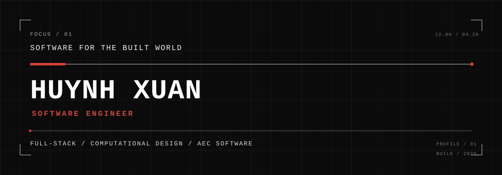

<p align="center">
  
</p>
<p align="center">
  <strong>FULL-STACK ENGINEERING · COMPUTATIONAL DESIGN · AEC SOFTWARE</strong>
</p>
<p align="center">
  <a href="https://www.linkedin.com/in/huynh-xuan-060b25369/">LinkedIn</a>
  &nbsp;·&nbsp;
  <a href="https://github.com/Xhuynh16">GitHub</a>
</p>
<br/>
`[01] / PROFILE`
<table>
<tr>
<td width="54%" valign="top">
SOFTWARE FOR THE BUILT WORLD
I'm Huynh Xuan, a Software Engineer at CUBIC Architects.
I work at the intersection of software engineering and the architecture / AEC domain, building full-stack applications, backend systems, automation workflows, and developer tools.
My current focus is:
`FULL-STACK` · `BACKEND SYSTEMS` · `COMPUTATIONAL DESIGN` · `AEC`
</td>
<td width="46%" valign="top">
```txt
ROLE       Software Engineer
DOMAIN     Architecture / AEC

PRIMARY    C# / TypeScript
BACKEND    .NET / NestJS
FRONTEND   Angular

STATUS     BUILDING
NEXT       Go / Systems
```
</td>
</tr>
</table>
---
`[02] / ENGINEERING DIRECTION`
```text
DESIGN / AEC
     │
     ▼
   DATA
     │
     ▼
 SOFTWARE
     │
     ▼
AUTOMATION
     │
     ▼
BETTER WORKFLOWS
```
I'm interested in how software can improve the way architectural and engineering workflows are modeled, connected, automated, analyzed, and delivered.
My long-term direction is:
`SOFTWARE ENGINEERING × COMPUTATIONAL DESIGN × AEC`
Rather than treating software and design as separate disciplines, I want to build systems at the point where they intersect.
---
`[03] / STACK`
Area	Technologies
Languages	`C#` `TypeScript` `SQL`
Backend	`.NET` `ASP.NET Core` `NestJS`
Frontend	`Angular`
Data	`PostgreSQL` `Redis`
Messaging	`Kafka` `RabbitMQ`
Infra / Tools	`Docker` `Git` `GitHub`
---
`[04] / CURRENTLY EXPLORING`
<table>
<tr>
<td width="50%" valign="top">
GO / SYSTEMS
I'm learning Go to deepen my understanding of:
concurrency
backend services
networking fundamentals
CLI & developer tooling
distributed systems
performance-oriented software
```go
go build ./...
```
</td>
<td width="50%" valign="top">
COMPUTATIONAL DESIGN
I'm exploring concepts around:
geometry processing
parametric workflows
BIM / CAD automation
design-data pipelines
interoperability
AEC developer tooling
```txt
GEOMETRY → DATA → SOFTWARE
```
</td>
</tr>
</table>
---
`[05] / SELECTED ENGINEERING WORK`
> **STATUS / PORTFOLIO REBUILD IN PROGRESS**
I'm rebuilding my public engineering portfolio around projects that demonstrate more than feature delivery.
Each flagship project will aim to show:
`ARCHITECTURE` · `DESIGN DECISIONS` · `TESTING` · `PERFORMANCE`  
`OBSERVABILITY` · `RELIABILITY` · `DOCUMENTATION` · `MAINTAINABILITY`
`01 / FULL-STACK SYSTEM`
Production-oriented application architecture
Planned focus:
API and domain design
data consistency
caching
asynchronous messaging
automated testing
containerized development
observability
`STATUS: PLANNED`
---
`02 / COMPUTATIONAL DESIGN`
Software connecting programming, geometry, and AEC workflows
Planned focus:
geometry / model data
automation
workflow interoperability
measurable design operations
practical AEC use cases
`STATUS: PLANNED`
---
`03 / GO DEVELOPER TOOL`
A small systems-oriented tool built around a real engineering problem
Planned focus:
CLI design
concurrency
filesystem / networking
testing
releases
performance measurement
`STATUS: PLANNED`
---
`[06] / ENGINEERING PRINCIPLES`
`01 / CLEAR`	`02 / RELIABLE`	`03 / MEASURABLE`	`04 / USEFUL`
Architecture should communicate intent.	Failures should be expected and handled deliberately.	Performance decisions should be backed by evidence.	Technology should solve an actual problem.
---
`[07] / WHAT I'M BUILDING TOWARD`
```txt
FULL-STACK PRODUCT ENGINEERING
            +
      BACKEND SYSTEMS
            +
   COMPUTATIONAL DESIGN
            +
        AEC DOMAIN
            ↓
SOFTWARE FOR THE BUILT WORLD
```
The goal is not to collect technologies.
The goal is to develop the engineering depth to build reliable software, useful tools, and better technical workflows for the built environment.
---
<div align="center">
CONNECT
LinkedIn
  · 
GitHub
<br/>
<sub>
FULL-STACK ENGINEERING / COMPUTATIONAL DESIGN / AEC SOFTWARE
</sub>
</div>
